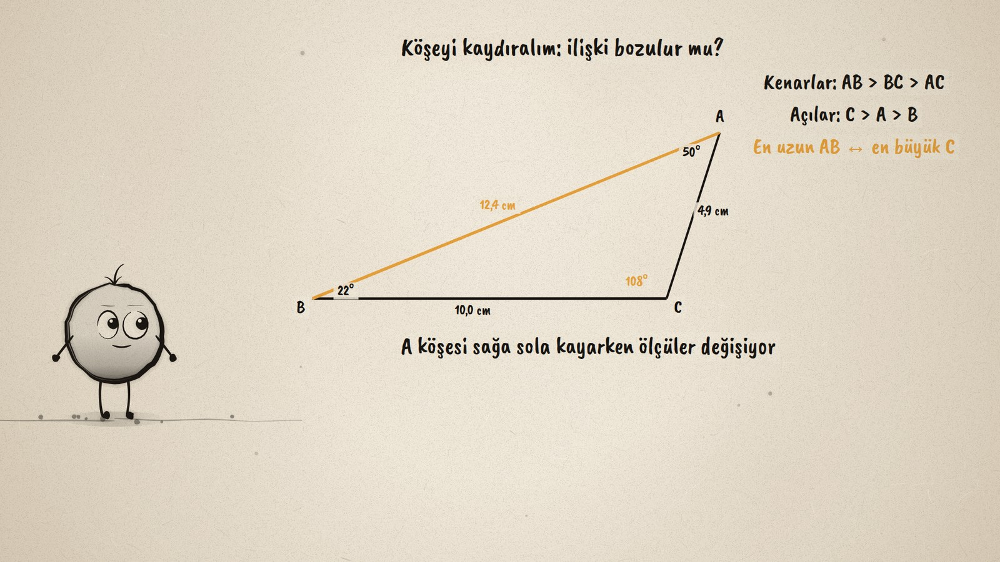
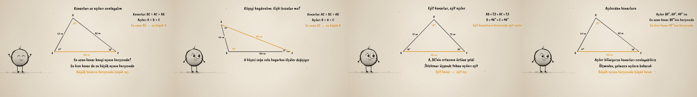

# Büyük Kenar, Büyük Açı · Sides and Angles of a Triangle

**▶ Tarayıcıda izleyin / Watch in the browser:** https://hakanatas.github.io/buyuk-kenar-buyuk-aci/ 
**⬇ MP4 + altyazılar / MP4 + subtitles:** [Releases](https://github.com/hakanatas/buyuk-kenar-buyuk-aci/releases) 
**✎ Kullanılan istem / The prompt behind it:** [PROMPT.md](PROMPT.md) 
**🎞 Bütün filmler / All films:** [Nokta'nın Filmleri](https://hakanatas.github.io/nokta-filmleri/?sinif=8)

> **TR —** 8. sınıf matematik "Geometrik Şekiller" temasındaki MAT.8.3.1 öğrenme çıktısı için hazırlanmış, tamamen JavaScript ile çizilen 92 saniyelik mürekkep animasyonu. Bir ABC üçgeninin kenar uzunlukları ve açı ölçüleri canlı olarak ölçülüyor; iç açıların toplamı 180°. Kenarlar uzundan kısaya, açılar büyükten küçüğe sıralanıyor: en uzun kenar en büyük açının, en kısa kenar en küçük açının karşısında. Dinamik bir çizim gibi A köşesi kaydırılıyor; en uzun kenar BC'den AB'ye, sonra AC'ye geçiyor ama eşleşme hiç bozulmuyor. İkizkenar durumda eşit kenarların karşısındaki açılar da eşit. Son olarak açılar biliniyorsa kenarların ölçmeden sıralanabildiği gösteriliyor (80°, 60°, 40°). Altyazılar Türkçe, İngilizce ya da ikisi birlikte seçilebilir.

A 92-second ink animation for **8th-grade maths**. Nokta, the ink character from [The Learning Ink](https://github.com/hakanatas/the-learning-ink), is the guide again. Every length and angle on screen is measured from the drawing itself (`measure` in `scenes/scene1.js`), and the orderings and the amber highlight are recomputed on every frame, so the relation holds on screen because it holds in the geometry, not because it was typed in.

## Learning outcome

MEB, Türkiye Yüzyılı Maarif Modeli, Ortaokul Matematik, 8th grade, "Geometrik Şekiller" theme:

**MAT.8.3.1. Matematiksel araç ve teknoloji yardımıyla üçgenin kenarları ve açıları arasındaki ilişkiyi yorumlayabilme**
- a) Üçgenin kenar ve açı özelliklerini inceler.
- b) Üçgenin kenar uzunluklarının büyüklüğüne göre açıların ölçülerini, açıların ölçülerinin büyüklüğüne göre kenar uzunluklarını sıralar.
- c) Üçgenin kenar uzunlukları ve açı ölçüleri arasındaki ilişkiyi ifade eder.

## Scenes

| # | Time | Scene | What happens | Outcome |
|---|---|---|---|---|
| 1 | 0–10 s | Üçgen | Live side lengths and angles; the angles add up to 180°. | a |
| 2 | 10–28 s | Sırala | The longest side faces the largest angle, the shortest the smallest. | b |
| 3 | 28–46 s | Köşeyi kaydır | The longest side changes, the match never breaks. | b, c |
| 4 | 46–64 s | İkizkenar | AB = AC and B = C. | c |
| 5 | 64–80 s | Açılardan kenarlara | 80°, 60°, 40°: the sides ordered without measuring. | b |
| 6 | 80–92 s | Aklında kalsın | Longest side, largest angle. | a–c |

## Running it

- **Preview:** double-click `index.html` (it works offline).
- **MP4:** run `npm install` once, then `npm run export -- --format=horizontal --captions=tr`.
- **Subtitles and narration:** `npm run srt` writes `out/captions_*.srt` and `narration_notes.txt`.
- **Editing:**
  - Caption text, timings and narration notes: `captions.js`
  - Everything on screen is drawn by `LI.world(t)` in `scenes/scene1.js` (the triangle, the measurements, the words); the other scenes only set the camera.
  - Nokta's poses: `src/draw/film.js`; layout for 16:9 and 9:16: `src/draw/kd.js`

It uses the same engine as The Learning Ink: `renderFrame(t)` as a pure function of time, seeded randomness, and frame-by-frame export.
